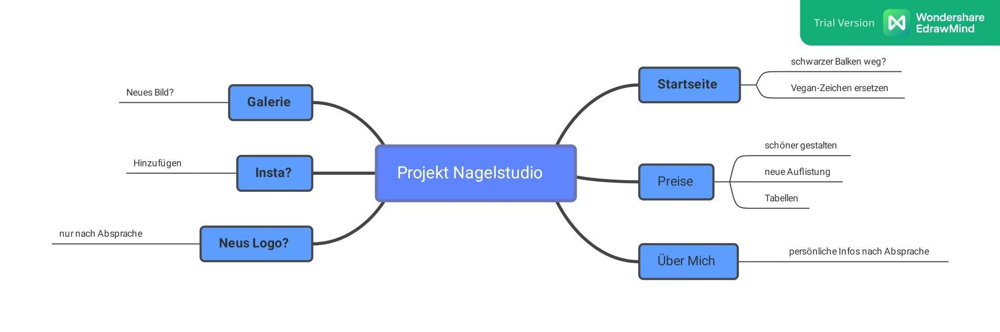

+++
title = "Treffen mit der Auftraggeberin "
date = "2021-09-14"
draft = false
pinned = false
tags = ["meeting"]
image = "meog.png"
description = "Ich treffe heute unsere Arbeitgeberin und werde das weitere vorgehen mit ihr besprechen. "
+++
Für das treffen habe ich auf dem Word ein Protokoll erstellt, welches ich während dem Meeting führen werden. Im Meeting werde ich mich auf das von uns erstellte Mindmap (siehe Bild) beziehen. Wir werden dann die besprochenen Punkte versuchen umzusetzen und nehmen danach wieder Rücksprache mit unserer Auftraggeberin auf. 

###### *Nächste Woche geht es dann weiter...*

